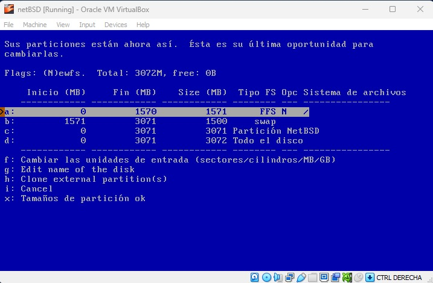

### Instalacion NetBSD
**- Empezamos por poner la ram dada por la guia**

**- Ponemos la cnatidad de memoria dada por la guia**

**- Configuramos la terjeta de red en modo puente**

**- Agregamos la imagen**

**- Empezamos la instalacion con el idioma de nuestra preferencia:**

**- Configuramos el tipo de teclado**

**- Seleccionamos la primer opcion: "Instalar NetBSD en el disco duro"**

**- Le damos que si**

**- Seleccionamos la primer opcion**

**- Cualquier metodo sirve, pero en nuestro caso podemos elegir "MBR"**

**- Revisamos que este correcto y le damos aceptar**

**- Seleccionamos usar todo el disco**

**- Como los tamaños los tenemos que configurar, le damos en establecer los tamaños**

**- Revisamos las particiones ya existentes**

**- Cambiamos todo de tal manera como se ve en pantalla: Cambiar el tipo "FFS 2" a "FFS" y los tamaños de todo lo demas**

**-Le damos que si**

**- Usamos la consola BIOS**

**- Seleccionamos la instalacion minima**

**- Le damos en el medio CD**

**- Le damos continuar**

**- Y empezamos la configuracion de la red**

**- Elegimos la interfaz "wm0"**

**- Cambiamos los datos de tal manera que nos queden acorde a la guia:**

**- Le damos que si**

**- Y ya podemos dar por terminada la instalacion**

**- Salimos del menu**

**- Y finalmente podemos hacer las pruebas de ping**

